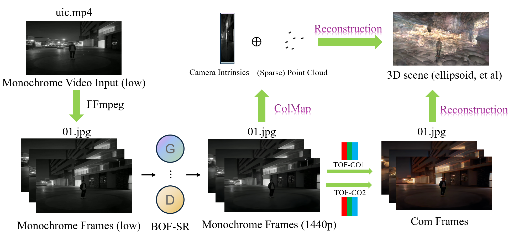

# GBC: Gaussian-Based-Colorization-and-Super-Resolution-for-3D-Reconstruction
## Overview  
Our project, GBC, takes low quality monochrome video input and generates a high resoluted, colored 3D scene using advanced techniques.  
## pipeline  

## BOF-SR

## COLMAP WORKFLOW

## 3dgs WORKFLOW

## Algorithm

## DEMO
current demo can view at [GBC](http://elucidator.cn/gbc-demo/)  

### STEPS：  
Detail steps of installation for GBC is coming soon!
<!--Install all requirements of Gaussian-Splatting-Windows, DeOldify, Real-ESRGAN in the same environment.
Download all weight files in of Gaussian-Splatting-Windows, DeOldify, Real-ESRGAN.
You can use 480p.py to convert video to monochrome, low resolution video.
Run main.py to start whole process.-->

## Datasets & pretrained model
Coming soon!

## Links  
Thanks for the work of,

[gaussian-splatting-Windows](https://github.com/jonstephens85/gaussian-splatting-Windows)  
[DeOldify](https://github.com/jantic/DeOldify)
[Real-ESRGAN](https://github.com/xinntao/Real-ESRGAN)

## Others    
<!--  -->

If any problem, pls contact [HungryNeko](https://github.com/HungryNeko).

<!--Equal contribution for [HungryNeko](https://github.com/HungryNeko) and [@ffftuan](https://github.com/ffftuanxxx). -->
